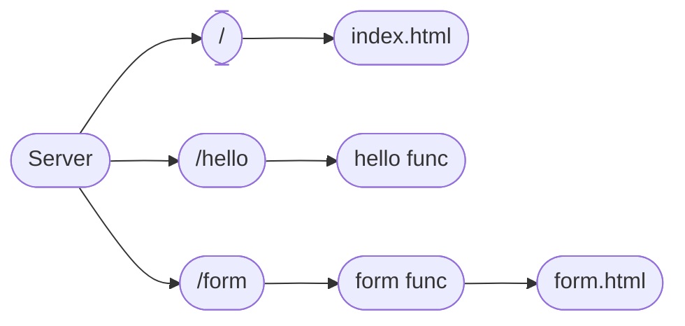

This kata is a simple web server written in golang.

## Commands
- `go run main.go utils.go` to run the project with temp build.
- `go build` will build the binary and we don't need to specify the files.
  
## Hierarchy
Below is the hierarchy of route to file.

## Key Points:
- `http.FileServer` can be used to serve files
- Functions being first class citizens allows to create middleware (NodeJS style)
- If we don't provide a mux to `http.ListenAndServe`, it will use the default one
- `http.Dir` can be used to navigate the directories in Golang.
- `log.New` can be used to set some prefix and file details to log entries.
- `time.Since` is a replacement to `time.Now().Sub()`
- `http` package has default status response codes
- `*http.Request` has `ParseForm()` and `FormValue` which can be used to deal with form values
